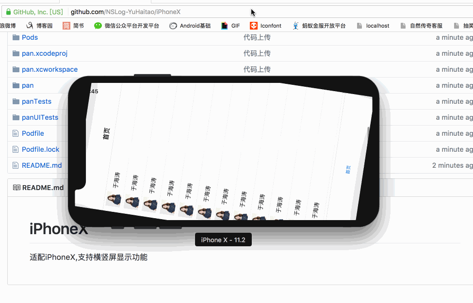

# iPhoneX
适配iPhoneX,支持横竖屏显示功能

横竖屏代码:
采用Masonry框架进行适配;
    
```
//为了适配横竖屏
float padding1 = HitoSafeAreaHeight;
[self.tableView mas_makeConstraints:^(MASConstraintMaker *make) {
    make.top.mas_equalTo(self.view);
    make.left.mas_equalTo(self.view);
    make.right.mas_equalTo(self.view);
    make.bottom.mas_equalTo(self.view).offset(-padding1);
}];
```

适配iPhoneX;

```
//状态栏高度
#define HitoStatusHeight [UIApplication sharedApplication].statusBarFrame.size.height
//导航栏高度
#define HitoNavHeight 44
//顶部高度
#define HitoTopHeight (HitoStatusHeight+HitoNavHeight)
//iPhoneX安全区域高度
#define HitoSafeAreaHeight (HitoStatusHeight>20?34:0)
//底部高度
#define HitoBottomHeight (49+HitoSafeAreaHeight)

```





